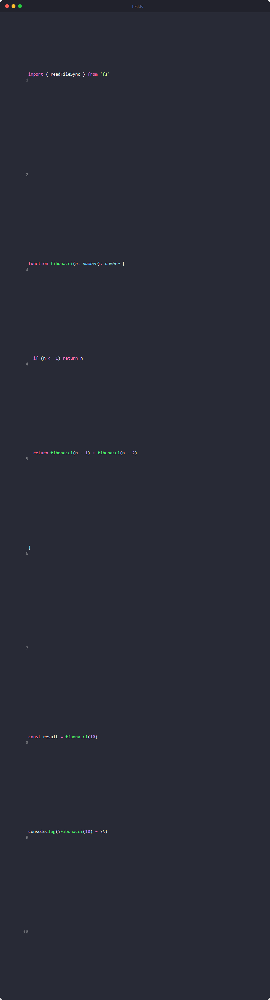

# snapcode

**Convert code into beautiful images for social media, presentations, and documentation.**

```
npx snapcode app.ts --theme dracula
```



## Why snapcode?

Stop taking screenshots of your code editor. `snapcode` generates pixel-perfect, syntax-highlighted code images ready for:

- Twitter / X
- LinkedIn posts
- Documentation
- Presentations
- Blog posts

## Quick Start

```bash
npx snapcode file.js
```

That's it. The image is saved to `output/file.js.png`.

## Themes

| Theme | Preview |
|-------|---------|
| `monokai` | Dark, warm (default) |
| `dracula` | Dark, purple accents |
| `nord` | Dark, blue-gray |
| `one-dark` | Dark, blue accents |
| `github-dark` | Dark, GitHub style |
| `github-light` | Light, GitHub style |
| `one-light` | Light, clean |
| `solarized-dark` | Dark, teal |
| `solarized-light` | Light, teal |

## Options

| Flag | Default | Description |
|------|---------|-------------|
| `-o, --output` | `output/<name>.png` | Output path |
| `-t, --theme` | `monokai` | Color theme |
| `--no-window` | — | Hide window frame |
| `--title` | filename | Custom window title |
| `-l, --lang` | auto | Override language |
| `--width` | `840` | Image width |
| `--font-size` | `14` | Font size |
| `--no-line-numbers` | — | Hide line numbers |
| `--high-quality` | — | 2x resolution |

## Examples

```bash
# Basic usage
npx snapcode index.ts

# Custom theme and output
npx snapcode main.rs --theme nord -o output/rust-code.png

# Minimal style
npx snapcode style.css --no-window --no-line-numbers --theme one-light

# High quality for printing
npx snapcode app.ts --high-quality --width 1200
```

## Supported Languages

TypeScript, JavaScript, Python, Rust, Go, Java, C, C++, C#, Ruby, PHP, Swift, Kotlin, HTML, CSS, SCSS, JSON, YAML, Markdown, Bash, SQL, Dockerfile, and 190+ more via [Shiki](https://shiki.style).

## License

MIT
